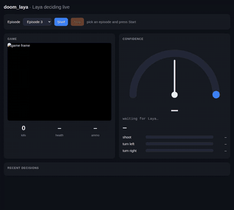

# doom_laya

Can a text classifier play Doom?

[Laya](https://huggingface.co/convaiinnovations/laya) is a non-autoregressive "decision model": it doesn't generate text, it reads a short text and picks one option from a list, with calibrated probabilities. This experiment uses it as the brain of a Doom marine in [ViZDoom](https://github.com/Farama-Foundation/ViZDoom). Every few game tics the game state is turned into one sentence, Laya picks an action, and a live dashboard shows what it is thinking.

Big thanks to [Convai Innovations](https://huggingface.co/convaiinnovations) for building and open-sourcing Laya, and to the [ViZDoom](https://vizdoom.farama.org) team for a wonderful research platform. See [Credits](#credits).

**Laya is used exactly as published: no fine-tuning and no training of any kind.** The only thing written for this experiment is the sentence it reads and the short descriptions of its three options.

**Result in one line:** zero-shot, Laya plays the arena about as well as a hand-written aimbot (13.7 vs 14.7 kills per episode).



Full clip (30 s, MP4): [assets/dashboard.mp4](assets/dashboard.mp4). It shows episode 3: the game frame, Laya's confidence needle and per-action probabilities, the exact sentence it read, and its recent decisions.

## How it works

```
ViZDoom state -> symbolic facts -> one short sentence -> Laya -> action -> ViZDoom
(labels buffer)  (enemy: FAR LEFT)  "Nearest enemy: FAR LEFT."  (3 options)  turn_left
```

- **Game:** ViZDoom scenario `defend_the_center`. The marine stands in the middle of a room and monsters come from the walls. Actions: `turn_left`, `turn_right`, `shoot`.
- **Perception:** ViZDoom's labels buffer gives on-screen bounding boxes for every actor. The nearest (widest) enemy's horizontal offset from the crosshair becomes a word: `CENTRE`, `LEFT`, `RIGHT`, `FAR LEFT`, `FAR RIGHT`, or "No enemy visible."
- **Decision:** one Laya `choice` question with three options, each described in a few words. The highest-probability option is played.
- **Model:** `convaiinnovations/laya` (ModernBERT-large, 421M parameters, Apache 2.0), loaded with `laya.load(...)` and used as is.
- **Frame skip:** each decision is held for 4 game tics.

## Results

Kills per episode over 15 episodes, `defend_the_center`:

| Policy | Mean kills | Std dev |
|---|---|---|
| Random | 1.6 | 1.1 |
| Scripted aimbot (same enemy info Laya sees) | 14.7 | 3.2 |
| **Laya, zero-shot (no fine-tuning)** | **13.7** | 4.2 |

Laya is close to the aimbot. The 1-kill gap is within noise at this sample size.

Caveats: these numbers come from an earlier version of the script that did not seed episodes, so runs are not exactly reproducible. Laya's decision latency is about 180 ms on a GTX 1650, so it plays slower than real time.

### The lesson that mattered: words, not numbers

The first prompt gave Laya pixel offsets ("Nearest enemy is 80 pixels to the left, size 20 pixels..."). Laya answered "shoot" almost every time and scored about the same as random (1 kill per episode). Replacing the numbers with a short symbolic phrase ("Nearest enemy: FAR LEFT.") took it to 19, 19 and 11 kills on the next three episodes, still with no training. Laya reads direction words well and does not do arithmetic on numbers.

## The dashboard

```
.venv/bin/python arena/play.py --policy laya --dash --episodes 10
# open http://127.0.0.1:8000
```

- Live game frame, plus kills, health and ammo.
- A rev-meter needle showing Laya's confidence in the action it just chose. The arc goes blue, amber, then red as confidence rises.
- Probability bars for `shoot`, `turn left`, `turn right`.
- The exact sentence Laya read, and a log of recent decisions.
- An **Episode** dropdown with **Start** and **Stop** buttons. Each episode number is a fixed seed: the same room, but different monster spawns. Picking the same episode again replays the same fight.

The server is a small stdlib HTTP server in `arena/play.py`. The page polls `/state` and posts to `/play?ep=N` and `/stop`.

## Run it

Requirements: Python 3.12, PyTorch, and a GPU with about 2.5 GB free (tested on a GTX 1650 with 4 GB). Two Laya processes at once ran the 4 GB card out of memory, so run one at a time.

```
python3 -m venv --system-site-packages .venv   # reuses an installed torch
.venv/bin/pip install laya vizdoom pillow      # add torch here if it is not installed
```

```
.venv/bin/python arena/play.py --policy bot --episodes 5      # scripted aimbot, fast
.venv/bin/python arena/play.py --policy random --episodes 5
.venv/bin/python arena/play.py --policy laya --episodes 5     # first run downloads Laya
.venv/bin/python arena/play.py --policy laya --watch          # ViZDoom window
.venv/bin/python arena/play.py --policy laya --dash --episodes 10
```

Each episode prints its kill count and per-decision latency.

## Files

```
arena/play.py            the whole experiment: perception, policies, dashboard server
arena/dash.html          the dashboard page (single file, no dependencies)
assets/dashboard.gif     preview embedded above
assets/dashboard.mp4     full clip of the dashboard while Laya plays
```

## Takeaways

- A decision model like Laya is a good fit for **small, fixed decisions from a short symbolic description**. It plays this arena about as well as a hand-written policy, with no training.
- Prompt design decides everything: short text and direction words instead of numbers.
- The confidence numbers are useful to watch. Laya is about 90% sure for enemies on the left, about 60% for enemies on the right, 68% for a centred enemy, and about 50% when nothing is visible. It picks the right action in each case, but it is less certain on the right.

## Ideas not tried

- Fine-tune Laya on the aimbot's (state, action) pairs.
- Try other ViZDoom scenarios such as `defend_the_line` or `health_gathering` with the same short-text approach.

## Credits

This experiment is a small demo built entirely on other people's work. Thank you:

- **Laya** by [Convai Innovations](https://huggingface.co/convaiinnovations). A fast, calibrated, non-autoregressive decision model, released under Apache 2.0. Model and card: [convaiinnovations/laya](https://huggingface.co/convaiinnovations/laya). Code: [github.com/NandhaKishorM/laya](https://github.com/NandhaKishorM/laya). Docs: [nandhakishorm.github.io/laya](https://nandhakishorm.github.io/laya/). Live demo: [laya-demo](https://huggingface.co/spaces/convaiinnovations/laya-demo). Please star the repo and go read their model card.
- **ViZDoom** by Marek Wydmuch, Michał Kempka, Wojciech Jaśkowski and contributors, now maintained under the [Farama Foundation](https://farama.org). Code: [github.com/Farama-Foundation/ViZDoom](https://github.com/Farama-Foundation/ViZDoom). Docs: [vizdoom.farama.org](https://vizdoom.farama.org). It turns Doom into a proper research platform, with a labels buffer, scenarios and a simple Python API. If you use it in research, cite the paper: Kempka et al., [*ViZDoom: A Doom-based AI Research Platform for Visual Reinforcement Learning*](https://arxiv.org/abs/1605.02097), IEEE CIG 2016.
- **Doom** by id Software, the game that started it all.

This project is an independent experiment and is not affiliated with or endorsed by any of the above.
